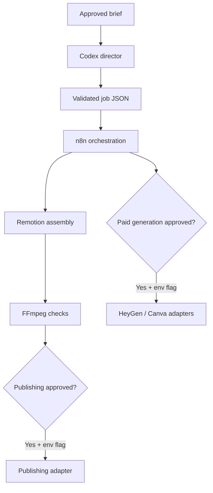

# Agentic AI Video Workflow Starter

An approval-gated starter for directing, orchestrating, assembling, and publishing AI-assisted videos. ChatGPT/Codex acts as director, n8n coordinates jobs, Remotion assembles deterministic video, and FFmpeg handles media inspection and post-processing. Canva and HeyGen are safe placeholders: this repository does not call paid generation or publish anything by default.

## Prompt-to-video interface

Phase 2 adds a local browser interface. Start it with:

```bash
cp .env.example .env
npm install
npm start
```

Open `http://127.0.0.1:3000`, enter one prompt, review the generated scenes, approve the brief, and render the MP4. Demo director mode works without an API key. To opt into OpenAI structured scripting, set `OPENAI_API_KEY`, choose `OPENAI_MODEL`, set `ALLOW_AI_SCRIPTING=true`, and select the OpenAI director checkbox. Keep secrets server-side and review API usage and costs.

## Safety model

Every job carries three independent human decisions:

1. `brief` — required before planning or rendering work begins.
2. `paidGeneration` — required before any paid provider call, plus `ALLOW_PAID_GENERATION=true`.
3. `publish` — required before publishing, plus `ALLOW_PUBLISHING=true`.

Approval values are `pending`, `approved`, or `rejected`. Keep both environment flags false in shared and development environments. The two-factor design prevents an edited JSON file alone from authorizing a paid or public action.

## Architecture



## What is included

- `schemas/job.schema.json` — strict contract for video jobs.
- `jobs/sample-job.json` — vertical public-education example.
- `prompts/director.md` — reusable director prompt.
- `src/orchestrator.ts` — validation, planning, and approval enforcement.
- `src/providers.ts` — Canva, HeyGen, and publishing placeholders.
- `src/remotion/` — programmatic scene composition.
- `n8n/agentic-video-workflow.json` — importable starter webhook and brief gate.
- `scripts/check-ffmpeg.mjs` — FFmpeg availability check.
- `.github/workflows/ci.yml` — type, schema, and FFmpeg validation.

## Quick start

Requirements: Node.js 22+, npm, and FFmpeg.

```bash
cp .env.example .env
npm install
npm test
npm run plan
npm run render
```

Output is written to `out/`, which is intentionally ignored by Git.

## Create a job

1. Copy `jobs/sample-job.json`.
2. Give it a unique lowercase `id`.
3. Write the objective, audience, output format, and scenes.
4. Keep paid generation and publishing `pending` while drafting.
5. Validate it:

```bash
node --import tsx src/orchestrator.ts validate jobs/your-job.json
```

6. After a human approves the brief, create the deterministic render plan:

```bash
node --import tsx src/orchestrator.ts plan jobs/your-job.json
```

To render a different job with Remotion:

```bash
npx remotion render src/remotion/index.ts MainVideo out/your-video.mp4 --props=jobs/your-job.json
```

## n8n setup

1. Start n8n locally or in your chosen environment.
2. Import `n8n/agentic-video-workflow.json`.
3. Activate the webhook only after configuring authentication or a secret header.
4. Add execution nodes for your deployment (Git checkout, queue, or API worker).
5. Keep paid-provider and publishing branches behind separate manual approval nodes.

The included workflow accepts a job only when `approvals.brief` is `approved`. It acknowledges the job but intentionally does not execute shell commands or contact external providers.

## Provider integrations

`src/providers.ts` defines inert placeholders. When implementing an adapter:

- load credentials from environment variables or a secret manager;
- never commit API keys;
- verify the appropriate job approval immediately before the external call;
- record provider request IDs, estimated cost, and outputs;
- make retries idempotent;
- require a separate publishing approval after the final video is reviewed.

## Recommended production hardening

- Authenticate n8n webhooks and restrict network access.
- Store jobs and approval events in an append-only audit log.
- Add per-job budgets and provider cost ceilings.
- Scan generated media and verify rights for uploaded assets.
- Add caption, accessibility, factual, privacy, and clinical/legal reviews as applicable.
- Pin dependency versions and commit a reviewed lockfile before production deployment.
- Publish through least-privilege service accounts.

## Important limitation

This is a workflow starter, not a configured Canva, HeyGen, or social-platform integration. No paid generation or publishing occurs until you deliberately implement an adapter, provide credentials, approve the job, and enable the corresponding environment flag.
