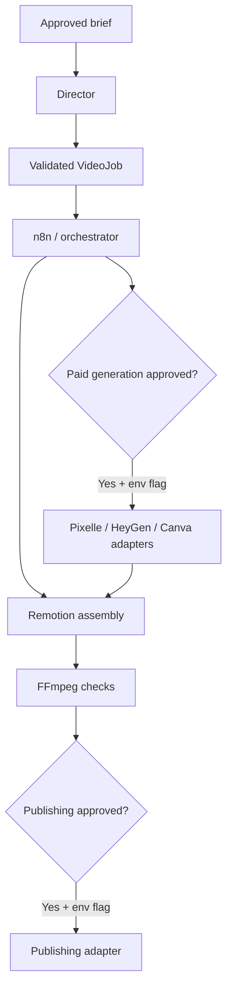

# Agentic AI Video Workflow Starter

An approval-gated starter for directing, orchestrating, assembling, and publishing AI-assisted videos. ChatGPT/Codex acts as director, n8n coordinates jobs, Remotion assembles deterministic video, FFmpeg handles media inspection and post-processing, and Pixelle-Video can now act as an optional scene-generation backend. Canva and HeyGen remain safe placeholders.

## Prompt-to-video interface

Start the local browser interface with:

```bash
cp .env.example .env
npm install
npm start
```

Open `http://127.0.0.1:3000`, enter one prompt, review the generated scenes, approve the brief, and render the MP4. Demo director mode works without an API key. To opt into OpenAI structured scripting, set `OPENAI_API_KEY`, choose `OPENAI_MODEL`, set `ALLOW_AI_SCRIPTING=true`, and select the OpenAI director checkbox. Keep secrets server-side and review API usage and costs.

## Medical video factory

Create a saved draft from one topic:

```bash
npm run create -- "TNK vs alteplase in acute ischemic stroke" --ai --evidence --evidence-query="tenecteplase alteplase stroke" --duration=60 --audience="Stroke clinicians"
```

Medical topics require retrieved evidence, scene citations, and human factual and clinical review before rendering. The AI director receives the retrieved abstracts but cannot validate or approve its own output. Check every scene's `citations` and `evidenceExcerpts`, then validate the saved draft:

```bash
npm run create -- --job=out/jobs/<job-id>.json --validate-evidence
```

Validation re-fetches PubMed identities and compares metadata and excerpts. It leaves human reviews pending. After a qualified reviewer has checked the exact saved job, resume it to render:

```bash
npm run create -- --job=out/jobs/<job-id>.json --approve-brief --approve-review --render
```

To add Pixelle-generated assets, also approve external generation for that saved job and enable the environment gate:

```bash
ALLOW_PAID_GENERATION=true npm run create -- --job=out/jobs/<job-id>.json --approve-brief --approve-review --approve-paid --assets --render
```

See `docs/MEDICAL_VIDEO_FACTORY.md` for the full workflow and flags. See `docs/EVIDENCE.md` for retrieval, validation, limitations, and migration of existing jobs.

## Safety model

Every job carries three independent human decisions:

1. `brief` — required before planning or rendering work begins.
2. `paidGeneration` — required before any external generation call, plus `ALLOW_PAID_GENERATION=true`.
3. `publish` — required before publishing, plus `ALLOW_PUBLISHING=true`.

Medical jobs additionally carry factual and clinical review states bound to the saved script and evidence. Rendering (including direct Remotion), external asset generation, planning, and publishing require validated scene citations and both human reviews. Evidence expires after 30 days. Refreshing or revalidating evidence resets approvals; edits invalidate content snapshots. These local snapshots detect changes but do not authenticate reviewers.

Approval values are `pending`, `approved`, or `rejected`. Keep both environment flags false in shared and development environments. The two-factor design prevents an edited JSON file alone from authorizing a paid or public action.

## Architecture



## Pixelle-Video integration

Pixelle is treated as a replaceable asset backend rather than the master compositor. Generated scene video is written back into an asset-enriched job, which Remotion then renders deterministically with text overlays and scene-level PMID/year citation footers.

Configure a reachable Pixelle API in `.env`:

```bash
PIXELLE_API_URL=http://127.0.0.1:8000
PIXELLE_FRAME_TEMPLATE=1080x1920/image_default.html
# Optional:
PIXELLE_MEDIA_WORKFLOW=
PIXELLE_TTS_WORKFLOW=
PIXELLE_API_KEY=
```

Pixelle generation uses its documented synchronous video endpoint in `fixed` mode, one scene at a time. To generate assets, the job must explicitly set `approvals.paidGeneration` to `approved` and the environment must also contain `ALLOW_PAID_GENERATION=true`.

```bash
npm run assets
```

The result is written to `out/<job-id>.assets.json`. The sample job can then be rendered with:

```bash
npm run render:assets
```

Without an approved paid-generation gate, `npm run assets` stops before contacting Pixelle.

## What is included

- `schemas/job.schema.json` — strict contract for video jobs, including scene visual/audio/generation and medical review state.
- `src/types.ts` — shared TypeScript job types.
- `src/factory.ts` — draft/resume factory CLI.
- `src/review.ts` — medical-topic detection and content-bound review enforcement.
- `src/evidence.ts` — bounded Europe PMC retrieval and source identity revalidation.
- `src/citations.ts` — scene citation, excerpt, freshness, and edit checks.
- `docs/EVIDENCE.md` — evidence workflow and its clinical limitations.
- `jobs/sample-job.json` — vertical public-education example.
- `prompts/director.md` — reusable director prompt.
- `src/orchestrator.ts` — validation, planning, asset generation, and approval enforcement.
- `src/providers/pixelle.ts` — Pixelle scene-video adapter.
- `src/providers.ts` — Canva, HeyGen, and publishing placeholders.
- `src/remotion/` — programmatic text/image/video/audio scene composition.
- `n8n/agentic-video-workflow.json` — importable starter webhook and brief gate.
- `scripts/check-ffmpeg.mjs` — FFmpeg availability check.
- `.github/workflows/ci.yml` — type, schema, generator, and FFmpeg validation.

## Quick start

Requirements: Node.js 22+, npm, and FFmpeg.

```bash
cp .env.example .env
npm install
npm test
# The stroke sample is an unapproved draft: plan/render intentionally block.
# Complete the evidence and human-review workflow before rendering.
```

Output is written to `out/`, which is intentionally ignored by Git.

## Create a job

1. Copy `jobs/sample-job.json`.
2. Give it a unique lowercase `id`.
3. Write the objective, audience, output format, and scenes.
4. Keep paid generation and publishing `pending` while drafting.
5. Validate it:

```bash
node --import tsx src/orchestrator.ts validate jobs/your-job.json
```

6. For medical jobs, complete `docs/EVIDENCE.md` first. After a human approves the brief and required reviews, create the deterministic render plan:

```bash
node --import tsx src/orchestrator.ts plan jobs/your-job.json
```

To render a different job with Remotion:

```bash
npx remotion render src/remotion/index.ts MainVideo out/your-video.mp4 --props=jobs/your-job.json
```

## n8n setup

1. Start n8n locally or in your chosen environment.
2. Import `n8n/agentic-video-workflow.json`.
3. Activate the webhook only after configuring authentication or a secret header.
4. Add execution nodes for your deployment (Git checkout, queue, or API worker).
5. Keep paid-provider and publishing branches behind separate manual approval nodes.

The included workflow accepts a job only when `approvals.brief` is `approved`. It acknowledges the job but intentionally does not execute shell commands or contact external providers.

## Provider integrations

When implementing or extending an adapter:

- load credentials from environment variables or a secret manager;
- never commit API keys;
- verify the appropriate job approval immediately before the external call;
- record provider request IDs, estimated cost, and outputs when available;
- make retries idempotent;
- require a separate publishing approval after the final video is reviewed.

## Recommended production hardening

- Authenticate n8n webhooks and restrict network access.
- Store jobs and approval events in an append-only audit log.
- Add per-job budgets and provider cost ceilings.
- Download or cache generated media for reproducible rendering rather than depending indefinitely on provider URLs.
- Scan generated media and verify rights for uploaded assets.
- Add caption, accessibility, factual, privacy, and clinical/legal reviews as applicable.
- Use the committed lockfile (`npm ci`) and review dependency updates before production deployment.
- Publish through least-privilege service accounts.

## Important limitation

Pixelle support is an initial scene-video bridge. The repository does not bundle Pixelle itself, does not configure its model providers, and does not call Pixelle until you supply a reachable API, configure the required template, explicitly approve paid generation in the job, and enable the environment gate. Canva, HeyGen, and publishing remain placeholders. Evidence validation checks source identity and exact abstract excerpts, not clinical truth, full-text support, guideline currency, or exhaustive retraction coverage. A qualified human must assess every medical claim and its applicability. The included stroke sample is intentionally unapproved and has no prevalidated citations.
